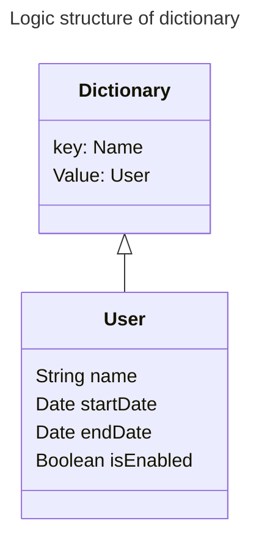

# **PDMIU** submit

<details>
  <summary>

  ## 👉 In italian
    
  </summary>

  <details>
  <summary>

  ### _A._ Nome e numero di matricola
    
  </summary>

  - Francesco Rombaldoni
  - Matricola: 330130
  
</details>

<details>
  <summary>

  ### _B._ Titolo del progetto
    
  </summary>

  - Il titolo del progetto è: **PIVPN**
  
</details>

<details>
  <summary>

  ### _C._ Breve panoramica dell'idea di progetto e delle principali caratteristiche dell´applicazione
    
  </summary>

  - L'idea del progetto è quella di realizzare un'applicazione in [Flutter](https://flutter.dev/) che faciliti l'interazione con la "VPN" [PIVPN](https://www.pivpn.io/), poiché quest'ultima è attualmente utilizzabile solo tramite "riga di comando". Inoltre, si intende implementare funzionalità aggiuntive, come la possibilità di disattivare un utente dopo una determinata data.
  
- L'applicazione sviluppata permette, tramite un'interfaccia grafica, di interagire con [PIVPN](https://www.pivpn.io/) per creare, eliminare, abilitare e disabilitare utenti. Consente, inoltre, di associare a ogni utente una data di inizio e una data di fine, disattivando automaticamente gli utenti che hanno superato il periodo di utilizzo consentito.

<br>

L'applicazione presenta al centro una tabella che consente di visualizzare tutti gli utenti registrati e il loro stato.
  
</details>

<details>
  <summary>

  ### _D._ Panoramica della esperienza utente
    
  </summary>

#### Primo avvio

Dopo aver configurato l'ambiente (seguendo la guida presente nella pagina principale), si può aprire l'applicazione. A questo punto, l'operatore può solo aggiungere nuovi utenti. Per fare questa operazione, deve completare i tre campi di input presenti nella parte superiore dell'interfaccia.

<details>
<summary>_Guarda l'immagine_</summary>


</details><br>

Il nome può essere una qualsiasi stringa, mentre le date devono essere necessariamente inserite nel formato americano (anno-mese-giorno).<br>

##### ⚠️ Avvertenze

- Per creare un utente sempre abilitato, è sufficiente aggiungere un utente con il campo "End Date" impostato su una data molto remota (es. 2050-01-01).
- La "data di fine" inserita deve essere sempre successiva alla data di inserimento dell'utente.
- Non si possono aggiungere due utenti con lo stesso nome.

Una volta completati i campi, l'operatore deve premere sul pulsante "Add User" per aggiungere l'utente alla VPN.

<details>
<summary>_Guarda l'immagine_</summary>


</details>

A questo punto, si aprirà una finestra separata contenente un QR code necessario per connettere la VPN, che l'operatore dovrà condividere con chi desidera connettersi.

<details>
<summary>_Guarda l'immagine_</summary>


</details>

Ogni volta che l'operatore esegue un'operazione, i cambiamenti dello stato della memoria vengono salvati automaticamente, garantendo la consistenza tra le informazioni di "PIVPN" e dell'interfaccia grafica.<br>
Come si sarà sicuramente notato, la tabella al centro dell'applicazione avrà acquisito un nuovo valore.

<details>
<summary>_Guarda l'immagine_</summary>


</details>

A questo punto, l'operatore può scegliere se aggiungere un nuovo utente (seguendo le istruzioni precedenti) oppure eseguire le altre tre operazioni riportate dall'interfaccia.

<details>
<summary>_Guarda l'immagine_</summary>


</details>

Per queste ultime operazioni, è necessario inserire nel campo apposito il nome dell'utente bersaglio (reperibile dalla tabella al centro).<br>

##### ⚠️ Avvertenze

- Non si può abilitare un utente che è stato disabilitato perché è stata superata la propria data di fine servizio.
- Per rigenerare un utente, è necessario eliminarlo e aggiungerlo nuovamente con le date aggiornate.

Una volta terminate le operazioni, l'applicazione non deve essere chiusa. Questo permette al secondo thread del programma di controllare, una volta al giorno, lo stato degli utenti. Nel caso in cui l'applicazione venisse chiusa, il controllo automatico non sarà eseguito, ma finché il computer rimane acceso, la VPN continuerà a funzionare.

##### Avvio successivo al primo

Se l'applicazione viene chiusa dopo il primo avvio e successivamente riaperta, l'operatore troverà lo stato dell'applicazione identico a com'era prima della chiusura, consentendo di operare normalmente.

</details>

<details>
  <summary>

  ### _E._ Discussione della tecnologia
    
  </summary>

  <details>
  <summary>

  #### Librerie utilizzate nel progetto
    
  </summary>

- `package:flutter/material.dart` -> Libreria di default
- `dart:async` -> Libreria per la gestione dei thread
- `dart:isolate` -> Libreria per la gestione dei thread
- `dart:io` -> Libreria per interagire con i file di sistema
- `package:process_run/shell.dart` -> Libreria per interagire con la shell
- `dart:ffi` -> Libreria per allocare la memoria, utilizzata per allocare il thread
  
</details>

<details>
  <summary>

#### La costruzione del database

Per salvare le informazioni degli utenti, l'applicazione utilizza una classe chiamata "Database" che salva i dati in un "dizionario". Questo dizionario viene serializzato e deserializzato per consentire il salvataggio delle informazioni sul disco.

##### Struttura logica del dizionario



Il parametro `name` si ripete in questa struttura poiché è sia una chiave del dizionario sia un attributo memorizzato all'interno della classe `User`. Questa scelta è stata fatta per semplificare il processo di serializzazione, che è stato implementato manualmente.

##### Processo di serializzazione

La serializzazione viene effettuata scrivendo su file una riga per ogni utente, strutturata nel seguente modo:

```
_key_ _name_ _startDate_ _endDate_ _isEnabled_
```

Per distinguere i vari parametri durante la lettura, la riga viene convertita in una lista utilizzando lo spazio come delimitatore. A ogni posizione degli elementi nella lista corrisponde un valore utile. Poiché la conversione dei parametri `startDate` e `endDate` in stringa include anche l'orario, la stringa risultante assume il seguente formato:

```
Rombo Rombo 2025-10-01 00:00:00 2025-10-21 00:00:00 true
```

I valori utili, quindi, sono indicati dalle seguenti posizioni:

```
[0] [1] [2] [4] [6]
```

L'ultimo aggiornamento dell'applicazione prevede che, a ogni operazione eseguita dall'utente, lo stato del database venga immediatamente scritto sul disco.
  
</details>

<details>
  <summary>

  #### Gestione della interazione con la shell
    
  </summary>
Siccome "PIVPN" richiede l'utilizzo della riga di comando per essere amministrata, la sfida è stata quella di fare in modo che l'applicazione potesse eseguire comandi da terminale, con il problema aggiuntivo che questi comandi necessitano di privilegi "sudo".  
Secondo la documentazione di "Dart", per ottenere questo risultato sarebbe sufficiente utilizzare la sintassi per lanciare comandi da terminale senza particolari privilegi, disabilitando a livello di sistema la necessità di eseguirli come "sudo".  
Tuttavia, considerando la diffusione del software, non si è voluto seguire questa strada poiché molto macchinosa. Si è preferito invece sviluppare una soluzione personalizzata.  
Il paradigma scelto prevede che l'applicazione richiami degli script (precedentemente impostati come eseguibili) in formato `.sh`, i quali a loro volta richiedono i privilegi "sudo".

##### Sviluppo degli script

Per funzionare correttamente, tutti gli script necessitano di un file `password.sh`, che deve essere creato dall'utente al momento dell'installazione dell'applicazione.  
Esempio del file:

```shell
#!/bin/bash
PASSWORD="your_sudo_password"
```

Una volta creato il file, la guida d'installazione dell'applicazione prevede l'esecuzione di uno script che rende eseguibili tutti gli script necessari per il corretto funzionamento dell'applicazione. Di seguito è riportato un esempio dello script:

```shell
#!/bin/bash

# Elenco degli script da rendere eseguibili
scripts=(
  "addUser.sh"
  "disableUser.sh"
  "enableUser.sh"
  "listUsers.sh"
  "removeUser.sh"
  "update.sh"
)

# Ciclo per rendere eseguibili i file
for script in "${scripts[@]}"; do
  if [ -f "$script" ]; then
    chmod +x "$script"
    echo "Reso $script eseguibile."
  else
    echo "Il file $script non esiste."
  fi
done
```

Questo script, dato un elenco di file nella stessa cartella, verifica l'esistenza di ciascun file e successivamente ne modifica le proprietà per renderli eseguibili.

##### Esempio di uno script eseguito dall'applicazione

Ecco un esempio di script utilizzato dall'applicazione:

```shell
#!/bin/bash

source ./password.sh

# Controlla se è stato fornito un parametro
if [ -z "$1" ]; then
  echo "Uso: $0 <parametro>"
  exit 1
fi

# Usa il parametro
param=$1
echo ${PASSWORD} | sudo -S pivpn -a -n $param

gnome-terminal -- bash -c "echo $param | sudo -S pivpn -qr; exec bash"

# Verifica se il comando è stato eseguito correttamente
if [ $? -eq 0 ]; then
  echo "Comando eseguito con successo."
else
  echo "Comando fallito."
  exit 1
fi
```

Questo script ha la funzione di aggiungere un utente alla VPN. Il suo funzionamento può essere spiegato suddividendolo in tre parti:  
1. **Controllo dell'argomento**: verifica se l'applicazione ha passato un argomento; in caso contrario, esce con un messaggio di errore.  
2. **Esecuzione del comando**: se l'argomento è presente, lo script lancia il comando per aggiungere l'utente alla VPN, seguito dal comando per aprire il pannello con il QR code necessario per il collegamento.  
3. **Verifica del risultato**: controlla se il comando è stato eseguito correttamente, restituendo un messaggio di successo o di errore. Il risultato viene riportato tramite un `echo`, che sarà raccolto dalla funzione di "Dart" utilizzata per eseguire i comandi da terminale.
  
</details>

<details>
  <summary>

  #### La gestione del thread 
    
  </summary>

  Nell'applicazione viene lanciato un thread separato rispetto al thread principale, in modo da eseguire una parte di codice che, finché l'applicazione rimane aperta, esegue un ciclo "while true" con una pausa di circa 24 ore. Questo thread controlla giornalmente lo stato di tutti gli utenti registrati dall'operatore. Nel caso in cui per un utente sia stata superata la data di fine servizio, quest'ultimo viene automaticamente disabilitato.

##### La classe del thread

```dart
class ThreadManager {
	bool _isRunning = false;
	Isolate? _isolate;
	ReceivePort? _receivePort;
	late StreamSubscription _subscription;
	
	void startThread(Function updateTable) {
		if (_isRunning) return;
		_isRunning = true;
		_receivePort = ReceivePort();
		_subscription = _receivePort!.listen((message) {
			if (message == 'update') {
				updateTable();
			}
		});
		Isolate.spawn(_threadEntry, _receivePort!.sendPort);
	}
	
	void stopThread() {
		if (!_isRunning) return;
		_isRunning = false;
		_isolate?.kill(priority: Isolate.immediate);
		_subscription.cancel();
		_receivePort?.close();
	}
	
	static void _threadEntry(SendPort sendPort) async {
		// Campo per il lavoro
		Mediator mediator = Mediator();
		
		bool isRunning = true;
		ReceivePort receivePort = ReceivePort();
		sendPort.send(receivePort.sendPort);
		bool isSomethingChanged = false;
		
		receivePort.listen((message) {
			if (message == 'stop') {
				isRunning = false;
				receivePort.close();
			}
		});
		
		while (isRunning) {
			mediator.GetAllUsers().forEach((value) {
				if (value.isEnabled && DateTime.now().isAfter(value.endDate)) {
					value.isEnabled = false;
					isSomethingChanged = true;
				}
			});
			// Salva il database solo se necessario
			if (isSomethingChanged) {
				mediator.SaveDatabase();
			}
			sendPort.send('update'); // Invia un messaggio di aggiornamento all'isolato principale
			isSomethingChanged = false;
			await Future.delayed(Duration(seconds: 86400)); // Ritardo di 24 ore
		}
		print('Thread fermato.');
	}
}
```

Per il controllo del thread, oltre all'utilizzo di una variabile di stato, viene usato un sistema di messaggi inviati alla "porta del thread".  
Quando il thread viene avviato, viene effettuata una chiamata di sistema per metterlo in esecuzione (a questo punto il thread è già allocato logicamente ma non è attivo), e successivamente viene aggiornato lo stato dei messaggi. Lo stesso processo viene eseguito al momento dell'interruzione del thread (che rimane comunque allocato in memoria, in attesa di essere riavviato).  
Durante l'esecuzione, il thread segue le istruzioni contenute nella funzione `_threadEntry()`. Dopo aver verificato lo stato del thread, avvia un ciclo "while true" che controlla lo stato degli utenti e, se necessario, li disabilita.

##### Variabili del thread

```dart
// Variabili per la gestione del thread
final ThreadManager _threadManager = ThreadManager();
bool _isThreadRunning = false;
```

##### Funzioni per la gestione del thread

```dart
void _startThread() {
	_threadManager.startThread(update_table);
	setState(() {
		_isThreadRunning = true;
	});
}

void _stopThread() {
	_threadManager.stopThread();
	setState(() {
		_isThreadRunning = false;
	});
}
```

Queste funzioni vengono utilizzate dalla classe principale `main` per gestire il thread durante il flusso dell'applicazione. In questo caso specifico, l'applicazione avvia il thread dopo aver ripristinato lo stato della memoria e lo interrompe poco prima di chiudersi, a seguito del comando corrispondente ricevuto dall'operatore.

##### Dove il thread viene avviato

```dart
void initState() {
	super.initState();
	WidgetsBinding.instance.addObserver(this);
	_startThread(); //<------------------------------- Avvia il thread per gestire gli utenti
	load_database();
}
```

##### Dove il thread viene terminato

```dart
void _onWindowClose() {
	_stopThread();
	//mediator.SaveDatabase(); //<--------------------------------------------------------------------------------------------------------------------------------
}
```
  
</details>
  
</details>
  
</details>


-----------------------------------------------------------------------------

<details>
  <summary>

  ## 👉 In english
    
  </summary>
</details>

-----------------------------------------------------------------------------


<details>
  <summary>

  ### 
    
  </summary>

  
  
</details>
